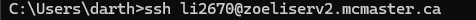
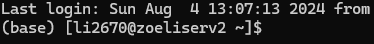
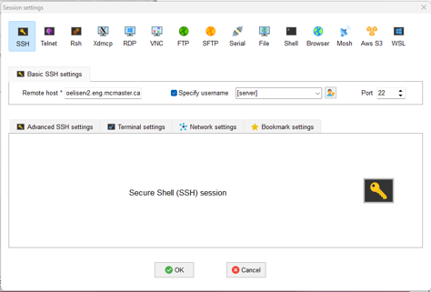
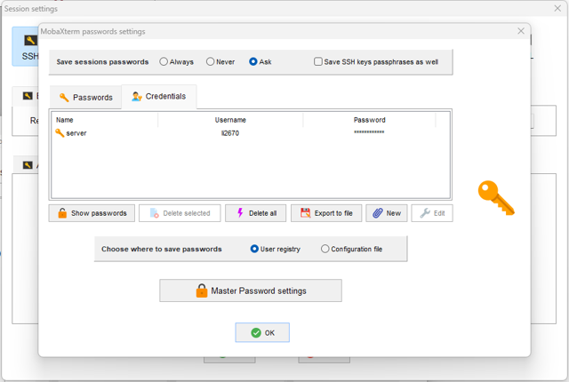
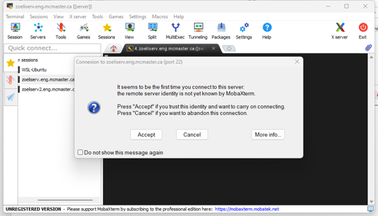
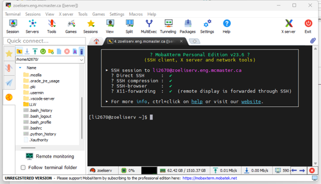

Connect to the Server
===================================
.. warning:: 

    Please make sure you are in McMaster Network or already connected to VPN before connecting to the server.

Terminal
------------------------------------
Start a ``cmd`` (Windows) or ``terminal`` (MacOS) on your computer.

.. note::

    You may need to check if SSH function is activate on your Windows by this `link <https://learn.microsoft.com/en-us/windows/terminal/tutorials/ssh>`_.

Input the following command:

.. code-block:: console
  
    ssh [username]@[server name]

It will let you accept identity, then input `yes`. Then you can input your password for server.

.. note::

    The Linux will not showing password and you can just enter it. 

You will see this if you login successfully.

MobaXterm
------------------------------------
Click `Session` to start a new session on MobaXterm

.. image:: images/server_connect/Picture1.png
  :width: 800

Click `SSH` tab to create new SSH connection, then input ``Remote host`` and ``Specify username`` information. Click the `Password` icon before ``port`` to manage the credentials for server. You can select the saved credentials by drop-down menu of ``Specify username``.

.. note::

   The server will require all users change the password when you first login, please update your credentials after change you password.

Click `Credentials` tab to and click `New` button to input your user name and password.

After create a connection, you will notice there is a new connection on the left side bar. Click the new connection and accept identity.

Now you are login the server.

