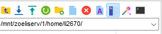
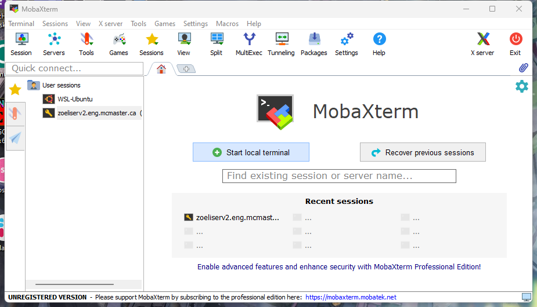
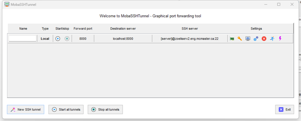
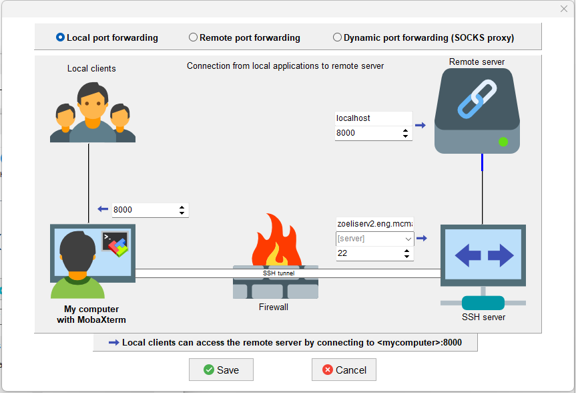

Server Usage
===============

Basic Usage Linux
------------------------
Every user will assign a folder under ``\home`` folder, and you only have permission to your own folder. The folder name is as follows:

.. code-block:: console
  
    /mnt/zoeliserv/1/home/[user name]

Most of operations of Linux will be done in Terminal, and you can use process you file (`upload, download, edit, delete`) by any SFTP software with interface.

You can always use ``tab`` to autocomplete the command, filename, and potential options.

``cd`` is one of most important command in Linux to change the current path of terminal. And any commands operations will set to the current path in default. Here are example for use cd command:

.. code-block:: console
  
    cd /home   # Change the path to /home folder
    cd /mnt/zoeliserv/1/home/li2670    # Change the path to /home folder with absolute path
    cd ..   # Change the path to parent folder

``ls`` command will list all content under the directory.

``clear`` command will clear the message of terminal.

You can find more information about Linux command via `this link <https://www.hostinger.com/tutorials/linux-commands>`_.

.. warning:: 

    Most of Linux command will not return any error messages if execute successfully and most of them will not give warning if you command may caused issue. Be caution with all command that you type!

Common Linux Commands
------------------------
Here are commands to start common software on server.

``R`` command will start the R environment.

``python`` or ``python3`` command will start the python environment.

``matlab`` command will start the Matlab.

``jupyter`` command will start the jupyter notebook.

Development Environments Set-up
-----------------------------------
Conda
*****
**Part I: Initial Conda Environment**

* Step A: Initialize conda for your user:

.. code-block:: console

   conda init

* Step B:Make the conda environment immediately available for your current shell session

.. code-block:: console

   source ~/.bashrc

* Step C: Deactivate the base conda environment

.. code-block:: console

   conda deactivate

**Part II: Usage of Conda Environment**

* Step 1: Create a New Conda Environment (You can use any version of python instead of 3.10)

.. code-block:: console

   conda create -n my_env python=3.10
   
Confirm with y when prompted.

* Step 2: Activate the New Environment

.. code-block:: console

   conda activate my_env

* Step 4: Install Software

.. code-block:: console

   pip install …

* Step 7: Deactivate the Environment

When you're finished, deactivate the Conda environment to return to your base environment.

.. code-block:: console

   conda deactivate

Port-Forwarding
------------------------
There are softwares need port-forwarding for use such as jupyter notebook, or other web-based applications. You need to get the port software need, then do the port-forwarding.

Click the ``Tunneling`` Tab.

Then click ``New SSH Tunnel``

Input the server information, forwarding port on both server and your device. The following example showing forward server port 8000 to my device port 8000.

Then click ``Start`` icon.

Then go to your browser and input following:

.. code-block:: console

   127.0.0.1:[port]
